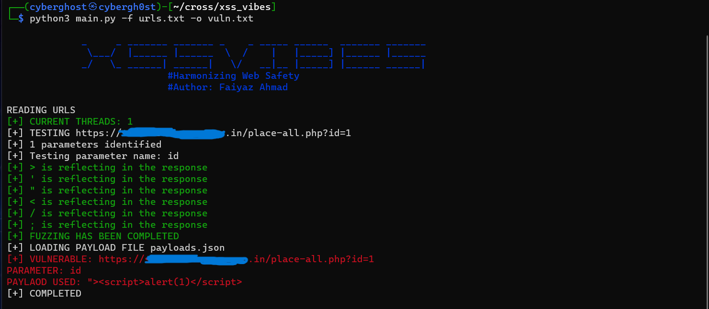

## XSS_VIBES
A modern tool written in Python that automates your xss findings.


### FEATURES

- Customizable: You can add your custom payload using adder.py
- Dynamic: The tool will prioritize the payloads based on the target's behavior
- Scalable: You can use this tool on bunch of links


### I N S T A L L A T I O N

```
1. Clone the repository: git clone https://github.com/faiyazahmad07/xss_vibes
2. Install the requirements file: pip3 install -r requirements.txt
3. Run the main.py file
```

### USAGE
```
python3 main.py -f <filename> -o <output>

-f: Filename that contains bunch of links
-o: Output filename in which all the vulnerable endpoints is stored
```
